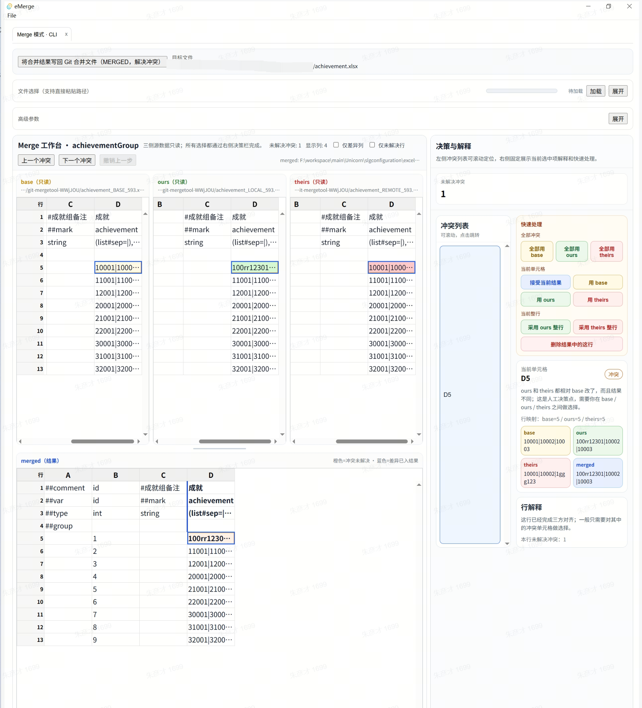

# eMerge

`eMerge` 是一个面向 Excel 的 Windows 桌面比较/合并工具，使用 `Tauri + React + TypeScript` 重构实现，保留原 `electron_excel_merge` 的核心能力，并补上了面向 Git 合并场景的工作流。

## 界面截图



## 主要功能

- Excel 文件夹比较
- 双文件 diff
- 三方 merge：`base / ours / theirs / merged`
- 支持 Git / Fork / 外部工具命令行拉起
- merge 结果可直接写回 `MERGED`
- 公式控制位禁编辑
- 共享控制位禁编辑，并支持主 sheet 同步
- 提供免安装单文件便携版构建脚本

## 技术栈

- Tauri 2
- React 19
- TypeScript
- ExcelJS

## 运行环境

- Windows 10/11
- Node.js
- Rust toolchain（MSVC）
- WebView2 Runtime

## 开发启动

```powershell
npm install
npm run tauri:dev
```

## 构建

前端构建：

```powershell
npm run build
```

标准 release 可执行文件：

```powershell
npm run tauri:build:nobundle
```

输出：

- `src-tauri/target/release/eMerge.exe`

## 便携版单文件 EXE

构建免安装单文件：

```powershell
npm run build:portable
```

本地构建输出：

- `dist-portable/eMerge-portable.exe`

仓库内可直接提交到 GitHub 的 Windows 可执行文件：

- `release/windows/eMerge-portable.exe`

说明：

- 该便携版是单个 `exe`
- 首次启动时会自动把内置资源解压到 `%LOCALAPPDATA%\\eMergePortable`
- 不需要安装程序
- 如果你是从 GitHub 仓库直接取 Windows 版本，优先看 `release/windows/`

## Git / Fork 外部工具配置

### Merge Tool

- Path: 指向构建后的 `eMerge-portable.exe` 或 `eMerge.exe`
- Arguments:

```text
"$BASE" "$LOCAL" "$REMOTE" "$MERGED"
```

### Diff Tool

- Path: 指向构建后的 `eMerge-portable.exe` 或 `eMerge.exe`
- Arguments:

```text
"$LOCAL" "$REMOTE"
```

## 项目结构

```text
src/
  main/                 Tauri 后端与 Excel 逻辑
  renderer/             React UI
src-tauri/              Rust 壳与 Tauri 配置
resources/              运行时资源
manual_test_data/       手工测试样例
tools/                  便携版构建脚本
release/windows/        可直接提交到 GitHub 的便携版 exe
```

## 仓库说明

- `resources/portable-git` 会随仓库提交，这是运行 CLI / Git 场景需要的资源
- 构建产物、临时截图、分析文件、`node_modules`、`src-tauri/target` 不应提交
- 示例测试用的 `.xlsx` 已通过 `.gitattributes` 标记为二进制文件

## 当前已完成的关键行为

- merge 模式下保存时修复部分工作簿的条件格式写回问题
- 对公式控制位和共享控制位做禁编辑与灰显
- CLI merge 启动时默认收起顶部大面板，减少操作干扰
- 右侧“当前单元格”信息卡颜色与工作台语义配色统一

## 已知限制

- 当前主要面向 Windows
- 便携版构建脚本依赖系统自带的 .NET Framework C# 编译器
- 若目标机器缺少 WebView2 Runtime，程序无法启动

## 发布建议

如果你准备把可执行文件也一并放进仓库，Windows 用户直接使用这个目录里的文件：

- `release/windows/eMerge-portable.exe`

如果你发布 GitHub Release，建议也上传同一个文件作为附件。

## License

暂未添加开源许可证。如果要公开发布，建议补一个明确的 `LICENSE` 文件。
